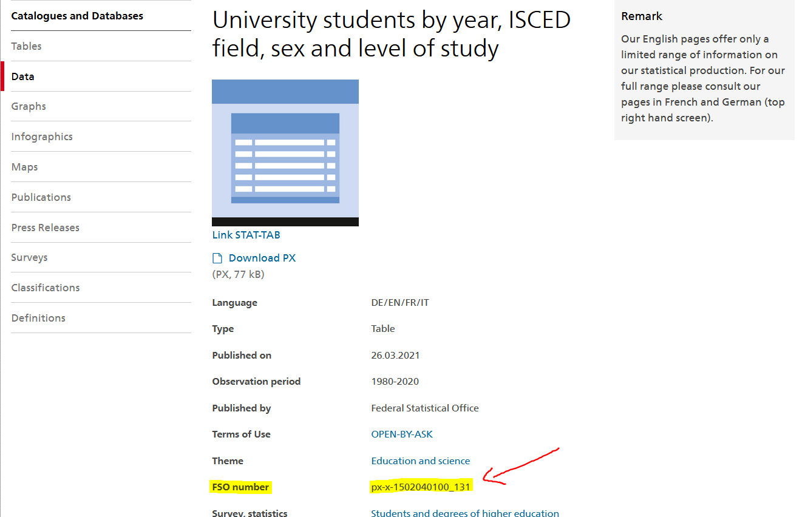

<!-- README.md is generated from README.Rmd. Please edit that file -->

<!-- badges: start -->
[](https://CRAN.R-project.org/package=BFS)
[](https://cran.r-project.org/package=BFS)
[](https://github.com/lgnbhl/BFS/actions)
<!-- badges: end -->

# BFS 

```{r setup, include=FALSE}
knitr::opts_chunk$set(
	echo = TRUE,
	message = FALSE,
	warning = FALSE
)
```

> Search and download data from the Swiss Federal Statistical Office

The `BFS` package allows to search and download public data from the 
[Swiss Federal Statistical Office (BFS is for Bundesamt für Statistik in German)](https://www.bfs.admin.ch/bfs/en/home/statistics/catalogues-databases/data.html){target="_blank"}
in a dynamic and reproducible way.

## Installation

```{r eval=FALSE}
# Install the released version from CRAN
install.packages("BFS")
```

To get a bug fix, or use a feature from the development version, you can install BFS from GitHub.

```{r eval=FALSE}
# install from Github
devtools::install_github("lgnbhl/BFS")
```

## Usage

```{r load BFS}
library(BFS)
```

### Get the data catalog

To search and download data from the Swiss Federal Statistical Office, you first need to retrieve information about the available public datasets.

You can get the catalog of the datasets by language based on the [RSS feed](https://www.bfs.admin.ch/bfs/en/home/statistiken/kataloge-datenbanken/daten/_jcr_content/par/ws_catalog.rss.xml) provided by the Swiss Federal Statistical Office. Note that Italian and English give access to less datasets.

```{r}
catalog_en <- bfs_get_catalog(language = "en")

catalog_en
```

### Search for a specific dataset

```{r bfs_search}
library(dplyr)

catalog_uni <- catalog_en %>%
  filter(title == "University students by year, ISCED field, sex and level of study")

catalog_uni
```

### Download a dataset in any language

To download a BFS dataset, add the related URL link from the `url_bfs` column of the downloaded metadata as an argument to the `bfs_get_dataset()` function.

```{r bfs_get_dataset}
df_uni <- bfs_get_dataset(url_bfs = catalog_uni$url_bfs, language = "en")

df_uni
```

You can access additional information about the downloaded data set using the `bfs_get_dataset_comments()` function.

```{r attributes}
bfs_get_dataset_comments(url_bfs = catalog_uni$url_bfs, language = "en")
```

In case the function fails to download the data set, you can add manually the BFS number in the `bfs_get_dataset()` function using the `number_bfs` argument.

```{r browseURL, eval=FALSE}
browseURL(catalog_uni$url_bfs) # open webpage
```



<br/>

You can try again running `bfs_get_dataset()`, but this time using the `number_bfs` argument.

```{r, eval=FALSE}
bfs_get_dataset(number_bfs = "px-x-1502040100_131", language = "en")
```

Sometimes the the data set doesn't exist in the API. It can be because the data exists only as an Excel file (an example [here](https://www.bfs.admin.ch/bfs/fr/home/statistiques/catalogues-banques-donnees/tableaux.assetdetail.18184062.html){target="_blank"})

## Other information

A [blog article](https://felixluginbuhl.com/blog/posts/2019-11-07-swiss-data/) showing a concrete example about how to use the BFS package and to visualize the data in a Swiss map.

The BFS package is using the [pxweb](https://github.com/rOpenGov/pxweb){target="_blank"} R package under the hood to access the Swiss Federal Statistical Office pxweb API.

This package is in no way officially related to or endorsed by the Swiss Federal Statistical Office (BFS).
