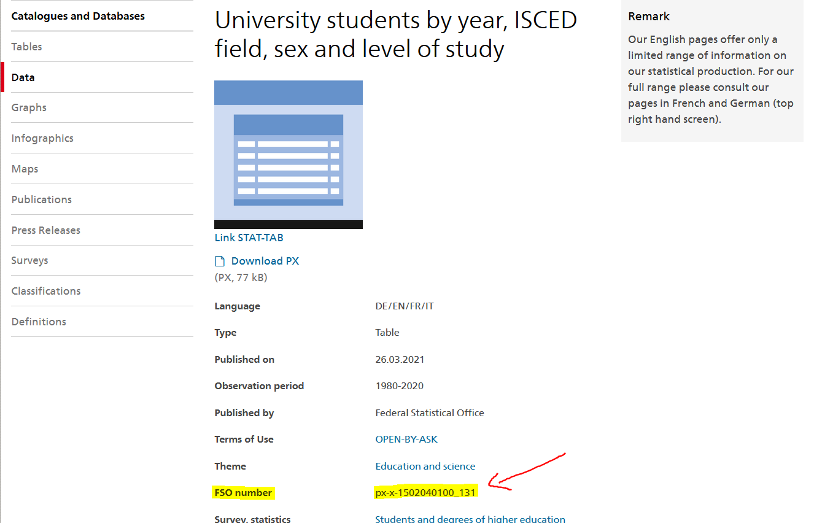

<!-- README.md is generated from README.Rmd. Please edit that file -->
<!-- badges: start -->

[](https://CRAN.R-project.org/package=BFS)
[](https://cran.r-project.org/package=BFS)
[](https://github.com/lgnbhl/BFS/actions)
<!-- badges: end -->

# BFS 

> Search and download data from the Swiss Federal Statistical Office

The `BFS` package allows to search and download public data from the
<a href="https://www.bfs.admin.ch/bfs/en/home/statistics/catalogues-databases/data.html" target="_blank">Swiss Federal Statistical Office (BFS is for Bundesamt für Statistik in German)</a>
in a dynamic and reproducible way.

## Installation

``` r
# Install the released version from CRAN
install.packages("BFS")
```

To get a bug fix, or use a feature from the development version, you can
install BFS from GitHub.

``` r
# install from Github
devtools::install_github("lgnbhl/BFS")
```

## Usage

``` r
library(BFS)
```

### Get the data catalog

To search and download data from the Swiss Federal Statistical Office,
you first need to retrieve information about the available public
datasets.

You can get the catalog of the datasets by language based on the [RSS
feed](https://www.bfs.admin.ch/bfs/en/home/statistiken/kataloge-datenbanken/daten/_jcr_content/par/ws_catalog.rss.xml)
provided by the Swiss Federal Statistical Office. Note that Italian and
English give access to less datasets.

``` r
catalog_en <- bfs_get_catalog(language = "en")

catalog_en
```

    ## # A tibble: 170 x 5
    ##    title            language published           url_bfs           url_px       
    ##    <chr>            <chr>    <chr>               <chr>             <chr>        
    ##  1 Air emissions a~ en       Air emissions acco~ https://www.bfs.~ https://www.~
    ##  2 Deaths per mont~ en       Deaths per month a~ https://www.bfs.~ https://www.~
    ##  3 Divorces and di~ en       Divorces and divor~ https://www.bfs.~ https://www.~
    ##  4 Energy accounts~ en       Energy accounts of~ https://www.bfs.~ https://www.~
    ##  5 Environmentally~ en       Environmentally re~ https://www.bfs.~ https://www.~
    ##  6 Live births per~ en       Live births per mo~ https://www.bfs.~ https://www.~
    ##  7 Marriages and n~ en       Marriages and nupt~ https://www.bfs.~ https://www.~
    ##  8 Permanent resid~ en       Permanent resident~ https://www.bfs.~ https://www.~
    ##  9 New registratio~ en       New registrations ~ https://www.bfs.~ https://www.~
    ## 10 Hotel accommoda~ en       Hotel accommodatio~ https://www.bfs.~ https://www.~
    ## # ... with 160 more rows

### Search for a specific dataset

``` r
library(dplyr)

catalog_uni <- catalog_en %>%
  filter(title == "University students by year, ISCED field, sex and level of study")

catalog_uni
```

    ## # A tibble: 1 x 5
    ##   title           language published          url_bfs             url_px        
    ##   <chr>           <chr>    <chr>              <chr>               <chr>         
    ## 1 University stu~ en       University studen~ https://www.bfs.ad~ https://www.b~

### Download a dataset in any language

To download a BFS dataset, add the related URL link from the `url_bfs`
column of the downloaded metadata as an argument to the
`bfs_get_dataset()` function.

``` r
df_uni <- bfs_get_dataset(url_bfs = catalog_uni$url_bfs, language = "en")
```

    ##   Downloading large query (in 4 batches):
    ##   |                                                                              |                                                                      |   0%  |                                                                              |==================                                                    |  25%  |                                                                              |===================================                                   |  50%  |                                                                              |====================================================                  |  75%  |                                                                              |======================================================================| 100%

``` r
df_uni
```

    ## # A tibble: 17,220 x 5
    ##    Year   `ISCED Field`   Sex   `Level of study`              `University stude~
    ##    <chr>  <chr>           <chr> <chr>                                      <dbl>
    ##  1 1980/~ Education scie~ Man   First university degree or d~                545
    ##  2 1980/~ Education scie~ Man   Bachelor                                       0
    ##  3 1980/~ Education scie~ Man   Master                                         0
    ##  4 1980/~ Education scie~ Man   Doctorate                                     93
    ##  5 1980/~ Education scie~ Man   Further education, advanced ~                 13
    ##  6 1980/~ Education scie~ Woman First university degree or d~                946
    ##  7 1980/~ Education scie~ Woman Bachelor                                       0
    ##  8 1980/~ Education scie~ Woman Master                                         0
    ##  9 1980/~ Education scie~ Woman Doctorate                                     70
    ## 10 1980/~ Education scie~ Woman Further education, advanced ~                 52
    ## # ... with 17,210 more rows

You can access additional information about the downloaded data set
using the `bfs_get_dataset_comments()` function.

``` r
bfs_get_dataset_comments(url_bfs = catalog_uni$url_bfs, language = "en")
```

    ##   Downloading large query (in 4 batches):
    ##   |                                                                              |                                                                      |   0%  |                                                                              |==================                                                    |  25%  |                                                                              |===================================                                   |  50%  |                                                                              |====================================================                  |  75%  |                                                                              |======================================================================| 100%

    ## # A tibble: 1 x 4
    ##   row_no col_no comment_type   comment                                          
    ##    <int>  <int> <chr>          <chr>                                            
    ## 1     NA      4 column_comment "To ensure that the presentations from cubes con~

In case the function fails to download the data set, you can add
manually the BFS number in the `bfs_get_dataset()` function using the
`number_bfs` argument.

``` r
browseURL(catalog_uni$url_bfs) # open webpage
```



<br/>

You can try again running `bfs_get_dataset()`, but this time using the
`number_bfs` argument.

``` r
bfs_get_dataset(number_bfs = "px-x-1502040100_131", language = "en")
```

Sometimes the the data set doesn’t exist in the API. It can be because
the data exists only as an Excel file (an example
<a href="https://www.bfs.admin.ch/bfs/fr/home/statistiques/catalogues-banques-donnees/tableaux.assetdetail.18184062.html" target="_blank">here</a>)

## Other information

A [blog
article](https://felixluginbuhl.com/blog/posts/2019-11-07-swiss-data/)
showing a concrete example about how to use the BFS package and to
visualize the data in a Swiss map.

The BFS package is using the
<a href="https://github.com/rOpenGov/pxweb" target="_blank">pxweb</a> R
package under the hood to access the Swiss Federal Statistical Office
pxweb API.

This package is in no way officially related to or endorsed by the Swiss
Federal Statistical Office (BFS).
